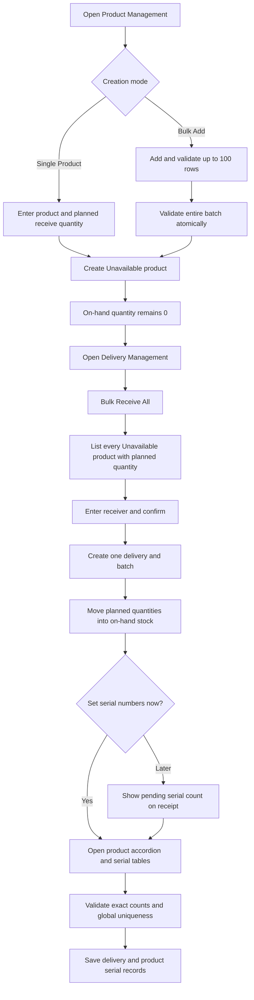

# Bulk Product Creation and Receiving — Feature Map

## Purpose

This document maps the product-creation, bulk-receiving, and deferred serial-number workflows implemented in the RJTech inventory prototype.

## Core quantity rule

Two quantity values now have different meanings:

| Field | Meaning | Changes stock? |
|---|---|---|
| `pending_receive_quantity` | Planned quantity entered while creating a new product | No |
| `product_quantity` | Actual on-hand inventory | Yes, only when a delivery is completed |

A newly created product therefore has:

- `pending_receive_quantity` = the quantity entered by the user
- `product_quantity` = `0`
- `has_received_initial_delivery` = `false`
- `product_status` = `Unavailable`

This prevents planned stock from appearing as inventory before it physically arrives.

## User workflow map

## Product creation

### Single product

Location: Product Management → New Item → Single Product.

- Quantity is enabled and required.
- The entered quantity is stored as the planned initial receipt.
- The new product remains `Unavailable` with zero on-hand quantity.
- Category + normalized product name + normalized brand must be unique.

### Bulk add

Location: Product Management → New Item → Bulk Add.

- Supports 1–100 product rows.
- Rows include category, product name, brand, price, receive quantity, reorder level, and description.
- Validation checks existing products and duplicates inside the submitted batch.
- Creation is atomic: if any row is invalid, no rows are created.
- Every created row starts `Unavailable`.

## Receiving

### Manual receive

The existing Receive Items drawer remains available for selecting products and quantities individually. It can capture serials before completion or leave a mismatch for later completion.

### Bulk receive all

Location: Delivery Management → Bulk Receive All.

Eligible products meet both conditions:

1. `has_received_initial_delivery == false`
2. `pending_receive_quantity > 0`

The confirmation modal displays product code, name, category, planned quantity, and status. Confirmation creates one delivery receipt and one batch containing all eligible products.

For each product:

- `product_quantity += received quantity`
- `pending_receive_quantity = 0`
- `has_received_initial_delivery = true`
- status is recalculated as `Available`, `Low Stock`, or `Out of Stock`

## Serial-number setup

After a receipt with missing serials is completed, the user is prompted:

- **Yes, Set Serials** opens the setup modal immediately.
- **Later** closes the prompt and leaves a red pending-serial count on the receipt.

The receipt's **Serials** action reopens the same setup modal later.

Each product is an expandable accordion item. Its dropdown contains a table with:

- sequence number
- one serial-number input per received unit
- the receipt's `batch_ID` indicator

Existing serial numbers are read-only. Saving requires:

- exactly one serial number for every received unit
- no blanks
- case-insensitive uniqueness within the submission
- no conflict with serial numbers already assigned to another product or receipt

Successful saving creates matching `DelSerial` and `ProductSerial` entries.

## Endpoint map

| Method | Endpoint | Responsibility |
|---|---|---|
| POST | `/Product/Create` | Create one product and preserve its planned initial quantity |
| POST | `/Product/BulkCreate` | Validate and atomically create up to 100 products |
| GET | `/Delivery/GetPendingInitialProducts` | Return products eligible for Bulk Receive All |
| POST | `/Delivery/CompleteDelivery` | Create delivery details, increase stock, and report missing serials |
| GET | `/Delivery/GetDeliveries` | Return receipts, product lines, serial lists, and pending counts |
| POST | `/Delivery/AssignDeliverySerials` | Validate and add deferred serial numbers |

## Main code map

| Area | File | Responsibility |
|---|---|---|
| Product state | `Capstone_RJTech/Models/Product.cs` | Planned and on-hand quantity fields |
| Shared prototype state | `Capstone_RJTech/Models/InventoryStore.cs` | In-memory products, categories, deliveries, details, and serial records |
| Product business/API flow | `Capstone_RJTech/Controllers/ProductController.cs` | Product/category validation, creation, updates, deletion, and search |
| Delivery business/API flow | `Capstone_RJTech/Controllers/DeliveryController.cs` | Receiving, delivery history, and serial persistence |
| Product UI | `Capstone_RJTech/Views/Product/AddProductView.cshtml` | Single and bulk product forms |
| Product behavior | `Capstone_RJTech/Views/Product/ProductManagement.cshtml` | Bulk-row management and API submission |
| Receive UI shell | `Capstone_RJTech/Views/Delivery/CreateDelivery.cshtml` | Existing manual receive drawer |
| Receive behavior | `Capstone_RJTech/Views/Delivery/DeliveryManagement.cshtml` | Bulk receive, post-receive prompt, deferred serial setup |

## Verification performed

- `dotnet build Capstone_RJTech.slnx --no-restore`: passed with zero warnings and zero errors.
- Endpoint test: created two products atomically, bulk-received both, observed three pending serials, assigned three serials, and verified the pending count became zero.
- Browser check: verified Product Management tabs, editable quantity, bulk row table, Bulk Receive All modal, Yes/Later prompt, receipt pending badge, expandable serial table, and batch indicator.
- Browser console check: no errors or warnings.

## Questions for the product owner

1. Should Bulk Receive All include only never-received (`Unavailable`) products, as implemented, or also low-stock/out-of-stock products with a separate pending order quantity?
2. Is one serial number mandatory for every unit of every product, or should categories/products have a `requires_serial_number` setting?
3. Should users be allowed to bulk-receive a partial quantity instead of the full planned initial quantity?
4. When a first-delivery receipt is deleted, should its quantity return to `pending_receive_quantity` and make the product `Unavailable` again, or should the current permanent-activation behavior remain?
5. The prototype stores all data in static in-memory lists. Which database should be used before multi-user deployment, and should receiving operations be transactionally locked?
