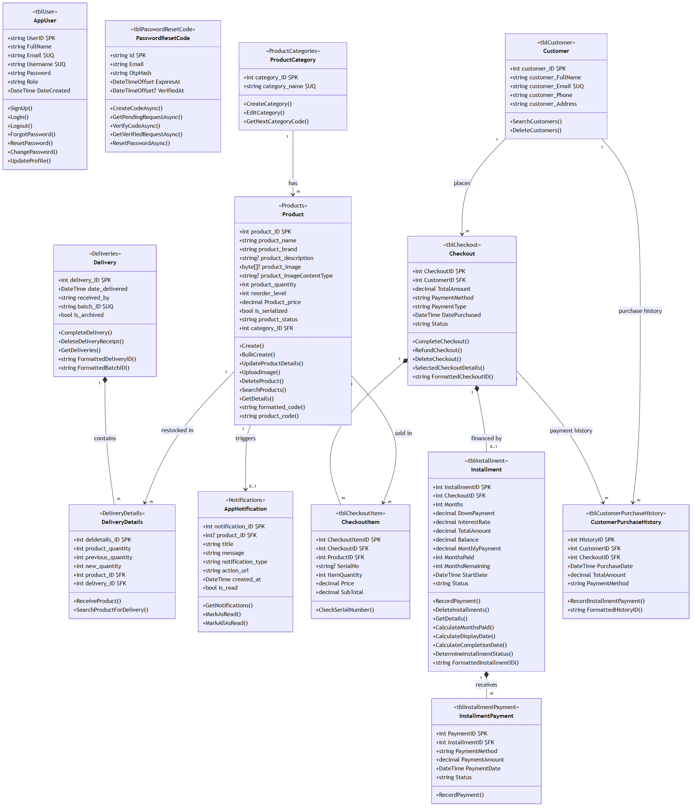

# Class Model — RJTech Capstone

Each class below is documented in the standard UML **three-section** layout:

| Section | Meaning |
| --- | --- |
| **Name** | The class name and its mapped database table |
| **Attributes** | Properties (fields) with their data types and keys |
| **Operations** | Behavior (controller/service actions and `[NotMapped]` computed getters) |

Notation used in **Attributes**:
- `PK` – Primary key
- `FK` – Foreign key
- `UQ` – Unique
- `?` – Nullable
- `(not mapped)` – `[NotMapped]` computed property (not stored in the database)

---

## Visual Class Diagram

> Rendered from `ClassModel-UML.mmd` (Mermaid source) — full diagram of all 13 classes with the **Name / Attributes / Operations** compartments and their relationships.

---

## 1. AppUser

**Name:** `AppUser` — Table `tblUser`

| # | Attribute | Type | Notes |
| --- | --- | --- | --- |
| 1 | `UserID` | `string` | `PK`, GUID string, max 450 |
| 2 | `FullName` | `string` | Max 150 |
| 3 | `Email` | `string` | `UQ`, max 256 |
| 4 | `Username` | `string` | `UQ`, 3–50 chars |
| 5 | `Password` | `string` | PBKDF2-SHA256 hash, never plaintext |
| 6 | `Role` | `string` | Always `"Owner"` (display only) |
| 7 | `DateCreated` | `DateTime` | Defaults to UTC now |

**Operations:**

| # | Operation | Description |
| --- | --- | --- |
| 1 | `SignUp()` | Create a new owner account (`AccountController.SignUp`) |
| 2 | `Login()` | Authenticate and sign in (`AccountController.Login`) |
| 3 | `Logout()` | End the session (`AccountController.Logout`) |
| 4 | `ForgotPassword()` | Start password reset — sends OTP |
| 5 | `VerifyOtp()` | Verify the OTP code (`ForgotPasswordVerify`) |
| 6 | `ResetPassword()` | Set a new password with a verified request |
| 7 | `ChangePassword()` | Change password while signed in (`SettingController.ChangePassword`) |
| 8 | `UpdateProfile()` | Update profile details (`SettingController.UpdateProfile`) |
| 9 | `AuthenticateAsync(email, password)` | Service-level credential check |
| 10 | `CreatePrincipal(user)` | Build the auth claims principal |

---

## 2. PasswordResetCode

**Name:** `PasswordResetCode` — Table `tblPasswordResetCode`

| # | Attribute | Type | Notes |
| --- | --- | --- | --- |
| 1 | `Id` | `string` | `PK`, random nonce, max 64 |
| 2 | `Email` | `string` | Max 256 |
| 3 | `OtpHash` | `string` | SHA-256 hash of the OTP, max 64 |
| 4 | `ExpiresAt` | `DateTimeOffset` | Expiry of the code |
| 5 | `VerifiedAt` | `DateTimeOffset?` | Set once the OTP was entered correctly |

**Operations:**

| # | Operation | Description |
| --- | --- | --- |
| 1 | `CreateCodeAsync(email)` | Issue a new OTP code for the account |
| 2 | `GetPendingRequestAsync(id)` | Retrieve an unverified reset request |
| 3 | `VerifyCodeAsync(id, otp)` | Check the OTP hash and mark verified |
| 4 | `GetVerifiedRequestAsync(id)` | Get a verified request for password reset |
| 5 | `ResetPasswordAsync(email, newPassword)` | Apply the new password |

---

## 3. ProductCategory

**Name:** `ProductCategory` — Table `ProductCategories`

| # | Attribute | Type | Notes |
| --- | --- | --- | --- |
| 1 | `category_ID` | `int` | `PK` |
| 2 | `category_name` | `string` | `UQ`, max 100 |

**Operations:**

| # | Operation | Description |
| --- | --- | --- |
| 1 | `CreateCategory(category)` | Add a new category (`ProductController.CreateCategory`) |
| 2 | `EditCategory(category_ID, category_name)` | Rename a category (`EditCategory`) |
| 3 | `GetNextCategoryCode(categoryId)` | Return the formatted code for a category |

---

## 4. Product

**Name:** `Product` — Table `Products`

| # | Attribute | Type | Notes |
| --- | --- | --- | --- |
| 1 | `product_ID` | `int` | `PK` |
| 2 | `product_name` | `string` | Max 150 |
| 3 | `product_brand` | `string` | Max 100 |
| 4 | `product_description` | `string?` | Max 500 |
| 5 | `product_Image` | `byte[]?` | Stored as `varbinary(max)` |
| 6 | `product_ImageContentType` | `string?` | MIME type of the image |
| 7 | `product_quantity` | `int` | Cannot be negative |
| 8 | `reorder_level` | `int` | Low-stock threshold |
| 9 | `Product_price` | `decimal(18,2)` | > 0 |
| 10 | `is_serialized` | `bool` | `true` = tracked by serial number |
| 11 | `product_status` | `string` | e.g. `"Available"` / `"Unavailable"` |
| 12 | `category_ID` | `int` | `FK` → ProductCategory |
| 13 | `formatted_code` | `string` | *(not mapped)* computed product code |
| 14 | `product_code` | `string` | *(not mapped)* alias of `formatted_code` |

**Operations:**

| # | Operation | Description |
| --- | --- | --- |
| 1 | `Create(model)` | Add a product (`ProductController.Create`) |
| 2 | `BulkCreate(request)` | Add many products at once (`BulkCreate`) |
| 3 | `UpdateProductDetails(...)` | Edit product information (`UpdateProductDetails`) |
| 4 | `UploadImage(id, image)` | Upload a product image |
| 5 | `Image(id)` | Serve the stored product image |
| 6 | `DeleteProduct(id)` / `DeleteProducts(ids)` | Remove product(s) |
| 7 | `GetDetails(id)` | Fetch full product details |
| 8 | `SearchProducts(query)` | Search products by name/brand/code |
| 9 | `FormatProductCode(category, id)` | Static helper that builds the formatted code |

---

## 5. Delivery

**Name:** `Delivery` — Table `Deliveries`

| # | Attribute | Type | Notes |
| --- | --- | --- | --- |
| 1 | `delivery_ID` | `int` | `PK` |
| 2 | `date_delivered` | `DateTime` | Defaults to now |
| 3 | `received_by` | `string` | Max 100 |
| 4 | `batch_ID` | `string` | `UQ`, max 100 |
| 5 | `is_archived` | `bool` | Soft-delete flag |
| 6 | `FormattedDeliveryID` | `string` | *(not mapped)* e.g. `DEL-001` |
| 7 | `FormattedBatchID` | `string` | *(not mapped)* e.g. `BATCH-001` |

**Operations:**

| # | Operation | Description |
| --- | --- | --- |
| 1 | `Receive()` | Show the receiving form (`DeliveryController.Receive`) |
| 2 | `CompleteDelivery(request)` | Finalize a delivery and update stock levels |
| 3 | `Details(id)` | View a delivery receipt |
| 4 | `GetDeliveries()` | List all deliveries (archived or active) |
| 5 | `DeleteDeliveryReceipt(id)` / `DeleteDeliveryReceipts(ids)` | Delete receipt(s) and reverse stock |
| 6 | `SearchProductForDelivery(query)` | Search products while receiving |

---

## 6. DeliveryDetails

**Name:** `DeliveryDetails` — Table `DeliveryDetails`

| # | Attribute | Type | Notes |
| --- | --- | --- | --- |
| 1 | `deldetails_ID` | `int` | `PK` |
| 2 | `product_quantity` | `int` | Units received |
| 3 | `previous_quantity` | `int` | Stock before delivery (audit) |
| 4 | `new_quantity` | `int` | Stock after delivery (audit) |
| 5 | `product_ID` | `int` | `FK` → Product |
| 6 | `delivery_ID` | `int` | `FK` → Delivery |

**Operations:**

| # | Operation | Description |
| --- | --- | --- |
| 1 | `ReceiveProduct()` | Create line items for a delivery (via `CompleteDelivery`) |
| 2 | `SearchProductForDelivery(query)` | Look up products to add to a delivery |

---

## 7. AppNotification

**Name:** `AppNotification` — Table `Notifications`

| # | Attribute | Type | Notes |
| --- | --- | --- | --- |
| 1 | `notification_ID` | `int` | `PK` |
| 2 | `product_ID` | `int?` | `FK` → Product (nullable) |
| 3 | `title` | `string` | Max 150 |
| 4 | `message` | `string` | Max 500 |
| 5 | `notification_type` | `string` | e.g. `"info"` / `"alert"` |
| 6 | `action_url` | `string` | Link when clicked |
| 7 | `created_at` | `DateTime` | Defaults to now |
| 8 | `is_read` | `bool` | Read/unread flag |

**Operations:**

| # | Operation | Description |
| --- | --- | --- |
| 1 | `GetNotifications(limit)` | Fetch recent notifications |
| 2 | `MarkAsRead(id)` | Mark one notification read |
| 3 | `MarkAllAsRead()` | Mark every notification read |
| 4 | `Synchronize()` | Auto-create low-stock notifications (`StockNotificationService`) |

---

## 8. Customer

**Name:** `Customer` — Table `tblCustomer`

| # | Attribute | Type | Notes |
| --- | --- | --- | --- |
| 1 | `customer_ID` | `int` | `PK` |
| 2 | `customer_FullName` | `string` | Max 150 |
| 3 | `customer_Email` | `string` | `UQ`, must be a valid `@gmail.com` |
| 4 | `customer_Phone` | `string` | Exactly 11 digits |
| 5 | `customer_Address` | `string` | Max 300 |

**Operations:**

| # | Operation | Description |
| --- | --- | --- |
| 1 | `SearchCustomers(query)` | Search customers by name/email/phone |
| 2 | `DeleteCustomers(ids)` | Delete selected customers |
| 3 | `FindOrCreateCustomer(request)` | Find an existing customer by email or create one at checkout |

---

## 9. Checkout

**Name:** `Checkout` — Table `tblCheckout`

| # | Attribute | Type | Notes |
| --- | --- | --- | --- |
| 1 | `CheckoutID` | `int` | `PK` |
| 2 | `CustomerID` | `int` | `FK` → Customer |
| 3 | `TotalAmount` | `decimal(18,2)` | Sale total |
| 4 | `PaymentMethod` | `string` | e.g. `"Cash"` |
| 5 | `PaymentType` | `string` | `"Full Payment"` / `"Installment"` |
| 6 | `DatePurchased` | `DateTime` | Defaults to now |
| 7 | `Status` | `string` | e.g. `"Paid"` / `"Refunded"` |
| 8 | `FormattedCheckoutID` | `string` | *(not mapped)* e.g. `CHK-001` |

**Operations:**

| # | Operation | Description |
| --- | --- | --- |
| 1 | `CompleteCheckout(request)` | Process the sale, reduce stock (`SalesController.CompleteCheckout`) |
| 2 | `RefundCheckout(id)` | Refund a sale and restore stock |
| 3 | `DeleteCheckout(id)` / `DeleteCheckouts(ids)` | Delete sale record(s) |
| 4 | `SelectedCheckoutDetails(id)` | View the items of a checkout |
| 5 | `CheckSerialNumber(serialNumber)` | Validate serial numbers for serialized items |

---

## 10. CheckoutItem

**Name:** `CheckoutItem` — Table `tblCheckoutItem`

| # | Attribute | Type | Notes |
| --- | --- | --- | --- |
| 1 | `CheckoutItemID` | `int` | `PK` |
| 2 | `CheckoutID` | `int` | `FK` → Checkout |
| 3 | `ProductID` | `int` | `FK` → Product |
| 4 | `SerialNo` | `string?` | Serial number for serialized products |
| 5 | `ItemQuantity` | `int` | ≥ 1 |
| 6 | `Price` | `decimal(18,2)` | Unit price at time of sale |
| 7 | `SubTotal` | `decimal(18,2)` | `Price × ItemQuantity` |

**Operations:**

| # | Operation | Description |
| --- | --- | --- |
| 1 | `CheckSerialNumber(serialNumber)` | Verify a serial number belongs to the product during checkout |

---

## 11. Installment

**Name:** `Installment` — Table `tblInstallment`

| # | Attribute | Type | Notes |
| --- | --- | --- | --- |
| 1 | `InstallmentID` | `int` | `PK` |
| 2 | `CheckoutID` | `int` | `FK` → Checkout |
| 3 | `Months` | `int` | Term length, ≥ 1 |
| 4 | `DownPayment` | `decimal(18,2)` | Initial payment |
| 5 | `InterestRate` | `decimal(5,2)` | Default `5%` |
| 6 | `TotalAmount` | `decimal(18,2)` | Amount financed |
| 7 | `Balance` | `decimal(18,2)` | Outstanding balance |
| 8 | `MonthlyPayment` | `decimal(18,2)` | Computed monthly due |
| 9 | `MonthsPaid` | `int` | Payments completed |
| 10 | `MonthsRemaining` | `int` | `Months − MonthsPaid` |
| 11 | `StartDate` | `DateTime` | Defaults to now |
| 12 | `Status` | `string` | e.g. `"Active"` / `"Overdue"` / `"Completed"` |
| 13 | `FormattedInstallmentID` | `string` | *(not mapped)* e.g. `INS-001` |

**Operations:**

| # | Operation | Description |
| --- | --- | --- |
| 1 | `GetInstallments()` | List installment contracts (`InstallmentController.Index`) |
| 2 | `GetDetails(id)` | View an installment with payment history |
| 3 | `RecordPayment(request)` | Record a monthly payment (`RecordPayment`) |
| 4 | `DeleteInstallments(ids)` | Delete installment record(s) |
| 5 | `Calculate(...)` | Compute down payment, monthly payment, and balance |
| 6 | `CalculateMonthsPaid(totalPaid, monthly, months)` | Derive months paid from payments |
| 7 | `CalculateDisplayDate(installment)` | Compute the next due/display date |
| 8 | `CalculateCompletionDate(installment)` | Compute expected completion date |
| 9 | `DetermineInstallmentStatus(installment, actualPaid)` | Active / Overdue / Completed |
| 10 | `UpdateInstallmentStatusesAsync()` | Refresh all statuses |

---

## 12. InstallmentPayment

**Name:** `InstallmentPayment` — Table `tblInstallmentPayment`

| # | Attribute | Type | Notes |
| --- | --- | --- | --- |
| 1 | `PaymentID` | `int` | `PK` |
| 2 | `InstallmentID` | `int` | `FK` → Installment |
| 3 | `PaymentMethod` | `string` | e.g. `"Cash"` |
| 4 | `PaymentAmount` | `decimal(18,2)` | Amount received |
| 5 | `PaymentDate` | `DateTime` | Defaults to now |
| 6 | `Status` | `string` | e.g. `"Paid"` |

**Operations:**

| # | Operation | Description |
| --- | --- | --- |
| 1 | `RecordPayment()` | Save a payment and update the installment balance (via `InstallmentService.RecordPaymentAsync`) |

---

## 13. CustomerPurchaseHistory

**Name:** `CustomerPurchaseHistory` — Table `tblCustomerPurchaseHistory`

| # | Attribute | Type | Notes |
| --- | --- | --- | --- |
| 1 | `HistoryID` | `int` | `PK` |
| 2 | `CustomerID` | `int` | `FK` → Customer |
| 3 | `CheckoutID` | `int` | `FK` → Checkout |
| 4 | `PurchaseDate` | `DateTime` | Date of the purchase/payment |
| 5 | `TotalAmount` | `decimal(18,2)` | Amount received in this payment |
| 6 | `PaymentMethod` | `string` | e.g. `"Cash"` |
| 7 | `FormattedHistoryID` | `string` | *(not mapped)* e.g. `PAY-001` |

**Operations:**

| # | Operation | Description |
| --- | --- | --- |
| 1 | `RecordInstallmentPayment()` | Append a payment to the customer's history (via `SalesController.RecordInstallmentPayment`) |

---

## Relationships (Associations)

| Source | Cardinality | Target | Meaning |
| --- | --- | --- | --- |
| ProductCategory | 1 ─── m | Product | One category has many products |
| Product | 1 ─── m | DeliveryDetails | A product is restocked in many deliveries |
| Delivery | 1 ─── m | DeliveryDetails | One delivery contains many lines *(composition)* |
| Product | 1 ─── 0..1 | AppNotification | A product may trigger a low-stock notification |
| Product | 1 ─── m | CheckoutItem | A product is sold in many checkout lines |
| Customer | 1 ─── m | Checkout | One customer places many checkouts |
| Checkout | 1 ─── m | CheckoutItem | One checkout contains many items *(composition)* |
| Checkout | 1 ─── 0..1 | Installment | A checkout may be financed by one installment *(composition)* |
| Installment | 1 ─── m | InstallmentPayment | One installment receives many payments *(composition)* |
| Customer | 1 ─── m | CustomerPurchaseHistory | One customer has many history entries |
| Checkout | 1 ─── m | CustomerPurchaseHistory | One checkout has many payment history entries |

> *(composition)* means the record cannot exist without its parent and is cascade-deleted with it.