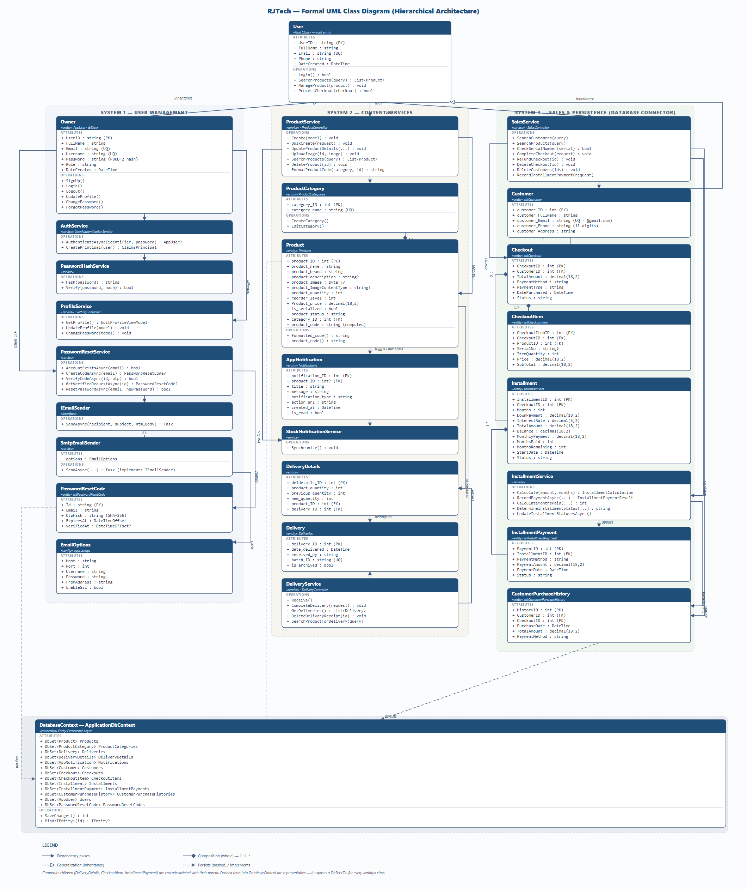

# Formal UML Class Diagram — RJTech Hierarchy

A hand-laid-out, architectural-class UML diagram that recreates the whole RJTech model
as a **single hierarchical tree** with a "God Class" root, three large system columns, and
a granular data layer at the bottom. It follows the same **three-section compartment layout**
as every other diagram in this folder: **Name / Attributes / Operations**.



> Sizes: PNG 2120 × 2520 · open the [SVG source](FormalClassDiagram.svg) in
> your browser, Inkscape, or draw.io to zoom/reedit.

---

## 1 — Overall structure

| Level | Region | Contents |
| --- | --- | --- |
| **Level 1 — God Class** | top-center | `User` — single root of the entire model. All three systems hang off it (via inheritance for `Owner`/`Customer`, via `uses` dependencies for the service systems). |
| **Level 2 — Systems** | three vertical bands | **System 1 · User Management**, **System 2 · Content Services**, **System 3 · Sales & Persistence (Database Connector)**. |
| **Level 3 — Sub-systems** | inside each band | Services and controllers that orchestrate the entities (e.g. `AuthService`, `ProductService`, `SalesService`, `DeliveryService`, `InstallmentService`). |
| **Level 4 — Data layer** | bottom band | `DatabaseContext (ApplicationDbContext)` — the connector exposing a `DbSet<TEntity>` for every `«entity»` class. |

```
                         ┌────────────┐
                         │    User    │  ← God Class (root)
                         └─────┬──────┘
            ┌──────────────────┼──────────────────┐
   ┌────────┴────────┐ ┌───────┴───────┐ ┌────────┴────────┐
   │ 1. User Mgmt    │ │ 2. Content    │ │ 3. Sales & DB   │
   │    (entities +  │ │    Services   │ │    Connector    │
   │     services)   │ │    (products) │ │    (checkout)   │
   └────────┬────────┘ └───────┬───────┘ └────────┬────────┘
            └───────────────┬──┴──────────┐       │
                      ┌─────┴─────┐  ┌────┴────┐
                      │ DatabaseContext (DbSet<T> for every entity) │  ← Data layer
                      └───────────┘  └─────────┘
```

## 2 — System 1 · User Management

Rooted at `Owner` (`AppUser`, `tblUser`), which inherits from `User`.

- `Owner` → **AuthService** → **PasswordHashService** (PBKDF2)
- `Owner` → **ProfileService** (SettingController)
- `Owner` → **PasswordResetService** → issues **PasswordResetCode** OTP (`tblPasswordResetCode`)
- **PasswordResetService** → **IEmailSender** `«interface»` **←implements** **SmtpEmailSender** → reads **EmailOptions** (`appsettings`)

## 3 — System 2 · Content Services

Rooted at **ProductService** (ProductController, `uses` on `User`).

- **ProductService** manages **ProductCategory** (`1 : 1..*` composition) and **Product**
- **Product** → triggers **AppNotification** (low stock) ← **StockNotificationService** synchronizes
- **Product** → restocked in **DeliveryDetails** → belongs to **Delivery** ← completed by **DeliveryService**

## 4 — System 3 · Sales & Persistence (Database Connector)

- **SalesService** (SalesController, `uses` on `User`) manages **Customer** (`1 : 1..*` → **Checkout** `*--` **CheckoutItem**)
- **Checkout** `0..1` → **Installment** `*--` **InstallmentPayment**, computed by **InstallmentService** (`delegates`)
- Both **SalesService** and **InstallmentService** record into **CustomerPurchaseHistory**
- All `«entity»` classes persist through **DatabaseContext** (representative dashed arrows; the connector exposes a `DbSet<T>` for every entity)

## 5 — Relationship legend

| Symbol | Meaning |
| --- | --- |
| Solid arrow (`→`) | Dependency — *uses / manages / reads* |
| Hollow triangle | Generalization (inheritance) — `Owner`, `Customer` **extend** `User` |
| Filled diamond | Composition (whole : part), with multiplicities e.g. `1 : 1..*` |
| Dashed arrow | Persistence (into `DatabaseContext`) or interface implementation (dashed + hollow triangle for `implements`) |

## 6 — Layout & re-editing

- The diagram is a **hand-positioned SVG** (`FormalClassDiagram.svg`) so the root, bands,
  and deep column hierarchy stay exactly where the architecture says they should —
  Mermaid's `subgraph` layout cannot guarantee a centered root or true vertical columns.
- Regenerate the PNG in a headless browser at the SVG's natural size:
  `chrome --headless=new --screenshot=FormalClassDiagram.png --window-size=2120,2520 file:///<path>/FormalClassDiagram.svg`
- Editable directly in **Inkscape** or **draw.io** (Import → SVG → select elements).

Sources that back the content: [`ClassModel-Tables.md`](ClassModel-Tables.md),
[`SystemOverview-UML.mmd`](SystemOverview-UML.mmd), [`ViewModels-UML.mmd`](ViewModels-UML.mmd),
[`Controllers-UML.mmd`](Controllers-UML.mmd), and the source models under `../Capstone_RJTech/Models/`.