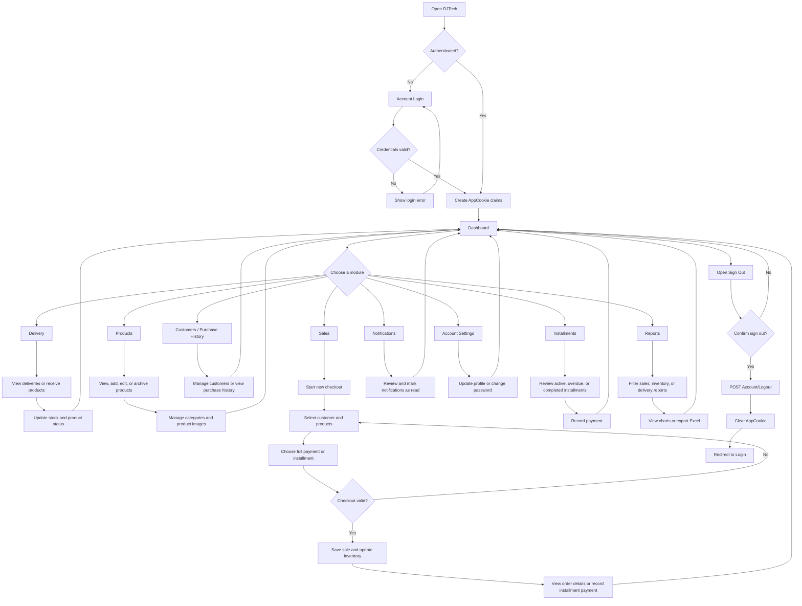

# RJTech Inventory System — Project Flow

## 1. Scope

This document describes the implemented user flow from account access through the main RJTech Inventory System modules and the final sign-out process.

The current application is an ASP.NET Core MVC application with server-rendered Razor views. The flow is based on the routes and controller actions in the repository, especially `AccountController`, `DashboardController`, `DeliveryController`, `ProductController`, `SalesController`, `ReportsController`, `NotificationController`, and `SettingController`.

## 2. Main Flow at a Glance

## 3. Application Startup and Entry Point

1. The application starts through `Program.cs`.
2. Entity Framework Core connects to SQL Server using the `RJTechDatabase` connection string.
3. Pending database migrations are applied with `Database.Migrate()`.
4. The initial administrator is seeded when the user table is empty.
5. The application configures the custom `AppCookie` authentication scheme.
6. A fallback authorization policy requires authentication for routes that are not explicitly anonymous.
7. HTTPS redirection, static files, routing, authentication, and authorization middleware are enabled.
8. MVC routes are mapped using `{controller=Home}/{action=Dashboard}/{id?}`.

## 4. Login Flow

### 4.1 Display the login page

- The user navigates to `GET /Account/Login`.
- If the user is already authenticated, the application redirects to the requested local return URL or the application root.
- Otherwise, the login view is displayed.

### 4.2 Submit credentials

- The user submits the username or email, password, and optional Remember Me selection to `POST /Account/Login`.
- Anti-forgery validation is performed.
- Invalid form data returns the login view with validation messages.
- `UserAuthenticationService.AuthenticateAsync` searches `AppUser` by username or email.
- The stored password hash is checked by `PasswordHashService`.
- Invalid credentials return the login page with an error message.
- Valid credentials create an authenticated principal containing the user ID, username, email, full name, and role-related identity data.
- `HttpContext.SignInAsync` issues the `RJTech.Auth` application cookie.
- The user is redirected to the safe local return URL, or to the default application route.

### 4.3 Unauthorized access

If an unauthenticated user requests a protected route, the authentication challenge sends the user to `/Account/Login`. If access is denied by authorization, the user is sent to `/Account/AccessDenied`.

## 5. Account and Password Recovery Flows

### 5.1 Registration

1. The user opens `GET /Account/SignUp`.
2. The user submits the registration form to `POST /Account/SignUp`.
3. The application validates the model and checks for duplicate username and email.
4. The password is hashed before the new `AppUser` is saved.
5. The new account receives the `Owner` role value.
6. The user is redirected to the login page.

### 5.2 Forgot password

1. The user opens `/Account/ForgotPassword`.
2. The submitted email is checked against the account database.
3. A password-reset verification code is created and sent through the configured SMTP email service.
4. The user opens the verification page and submits the code.
5. Invalid, expired, or incorrect codes return an error or restart the reset process.
6. A valid code permits the user to open `/Account/ResetPassword`.
7. The new password is saved as a hash.
8. The user is sent to the password-updated page and can log in again.

## 6. Dashboard Flow

After login, the dashboard is the main operational starting point.

1. The dashboard loads paid checkout totals, customer counts, outstanding installment totals, and inventory health.
2. Inventory is categorized as Available, Unavailable, Low Stock, or Out of Stock.
3. Daily and weekly sales data are calculated for the selected month and year.
4. Top-selling products and sales by category are calculated.
5. The user can change reporting period and category filters.
6. The user can use the shared navigation to move to another module.

## 7. Delivery and Receiving Flow

1. The user opens **Delivery** from the navigation.
2. Existing delivery receipts and their item details are loaded.
3. The user can open a delivery receipt to inspect its products.
4. The user opens **Receive Products** to create a delivery.
5. The application loads available products and recalculates product status.
6. The user enters the receiver, delivery date, products, and quantities.
7. The server validates required delivery data, positive quantities, duplicate products, and product existence.
8. A serializable database transaction saves the delivery and details and updates stock.
9. Product status and stock notifications are synchronized.
10. The user returns to the delivery list or dashboard.

## 8. Product and Category Flow

1. The user opens **Product > All Products**.
2. The application loads products and categories and recalculates product status.
3. The user may open product details, search products, update product details, or delete products subject to business rules.
4. To add a product, the user opens **Product > Add New Product**.
5. The user selects a category and enters product identity, price, stock, reorder level, status, serialization, and description data.
6. The server validates the product and prevents duplicate product identity combinations.
7. The product is saved and may receive an image upload.
8. To manage categories, the user opens **Product > Category**.
9. The user can create or edit categories, while category/product relationships are preserved by database constraints.
10. The user returns to the product list or dashboard.

## 9. Sales and Checkout Flow

### 9.1 Start a checkout

1. The user opens **Sales > New Checkout** or uses the header **New Checkout** button.
2. The checkout page loads products with available stock and valid product status.
3. The user searches for or selects a customer.
4. The user selects products and quantities.
5. For serialized products, the user enters or verifies the serial number and the application checks serial-number availability.
6. The user selects a payment method: Cash, E-Wallet, or Bank Transfer.
7. The user selects a payment type: Full Payment or Installment.

### 9.2 Complete the checkout

1. The checkout request is submitted to the server.
2. The server validates the customer, products, quantities, prices, payment method, and payment type.
3. The server rechecks stock and serialized-product rules before saving.
4. A valid checkout is saved with its checkout items.
5. Inventory quantities are reduced and product statuses are recalculated.
6. A full-payment checkout is recorded as paid.
7. An installment checkout creates an installment plan and tracks its outstanding balance.
8. Stock and installment notification services are synchronized.
9. The user receives a success response and can view the checkout details.

### 9.3 Sales management after checkout

- **Sales:** Lists non-cancelled checkout records and synchronizes overdue installment statuses.
- **Checkout details:** Shows the customer, items, payment information, and installment information when applicable.
- **Installment details:** Shows the plan and payment history.
- **Record installment payment:** Adds a payment and updates the installment balance/status.
- **Refund:** Changes the appropriate sale state according to the refund rules.
- **Purchase History:** Displays customer purchase history.

## 10. Customers and Purchase History Flow

1. The user opens **Customers**.
2. Customer records are loaded and sorted for display.
3. The user can manage customer information used during checkout.
4. A customer cannot be deleted when the customer has sales history.
5. The user opens **Purchase History** to review recorded customer purchases.
6. The user returns to Sales, Dashboard, or another module through navigation.

## 11. Installment Flow

1. The user opens **Installments**.
2. The application lists installment plans and their current status.
3. Active and overdue plans are identified using balance and due-date rules.
4. The user opens an installment record to review details.
5. The user records a payment.
6. The payment is saved, the balance is recalculated, and the plan status is updated.
7. Notifications are updated when an installment becomes due, overdue, or completed.

## 12. Reports and Export Flow

1. The user opens **Reports**.
2. The report computation service builds a current reporting snapshot from sales, inventory, and delivery data.
3. The user selects a report tab, such as sales, inventory, or delivery.
4. The user applies period, month, year, search, status, and sorting filters.
5. The server rebuilds the filtered report model.
6. The report is rendered in the browser with visual summaries and tables.
7. If required, the user selects **Export**.
8. The matching report is generated as an Excel file using ClosedXML.
9. The file is returned to the browser for download.

## 13. Notifications Flow

1. Stock and installment services generate or synchronize application notifications as business data changes.
2. The shared layout displays the notification indicator and unread count.
3. The user opens the notification flyout or notification page.
4. Notifications are retrieved through notification endpoints.
5. The user can mark one notification or all notifications as read.
6. The user returns to the active module without leaving the authenticated session.

## 14. Account Settings Flow

1. The user selects the account name or **Account Settings**.
2. The application loads the current account profile.
3. The user can update profile information through the profile update action.
4. The user can change the account password through the change-password action.
5. The application validates the current password and new password rules before saving the new hash.
6. The user returns to the dashboard or continues using the navigation.

## 15. Sign-Out and End of Session

1. The user selects the sign-out icon or account menu option.
2. The application displays the logout confirmation modal.
3. If the user cancels, the current page remains open.
4. If the user confirms, the browser submits an anti-forgery-protected `POST /Account/Logout` request.
5. The server signs out of the `AppCookie` authentication scheme.
6. The `RJTech.Auth` cookie is cleared or invalidated.
7. The server redirects the user to `/Account/Login`.
8. Any later request to a protected page triggers a new authentication challenge and returns the user to login.

## 16. End States

The project flow ends in one of these states:

- **Authenticated session continues:** The user returns to the dashboard or another protected module after completing an operation.
- **Unauthenticated session:** The user signs out and is returned to the login page.
- **Validation failure:** The current form or operation is redisplayed with an error so the user can correct it.
- **Not found:** The application returns a not-found result when a requested product, delivery, checkout, or related record does not exist.
- **Access denied:** The application displays the access-denied page when authorization prevents access.
- **Password recovery completed:** The user returns to the login process with a newly reset password.

## 17. Implementation References

- Authentication and account flow: `Controllers/AccountController.cs`
- Application startup and middleware: `Program.cs`
- Dashboard flow: `Controllers/DashboardController.cs`
- Delivery flow: `Controllers/DeliveryController.cs`
- Product flow: `Controllers/ProductController.cs`
- Sales and checkout flow: `Controllers/SalesController.cs`
- Reporting flow: `Controllers/ReportsController.cs`
- Shared navigation and logout modal: `Views/Shared/_Layout.cshtml`
- Persistence and relationships: `Data/ApplicationDbContext.cs`
- Client-side behavior: `wwwroot/js/` and `wwwroot/css/`
