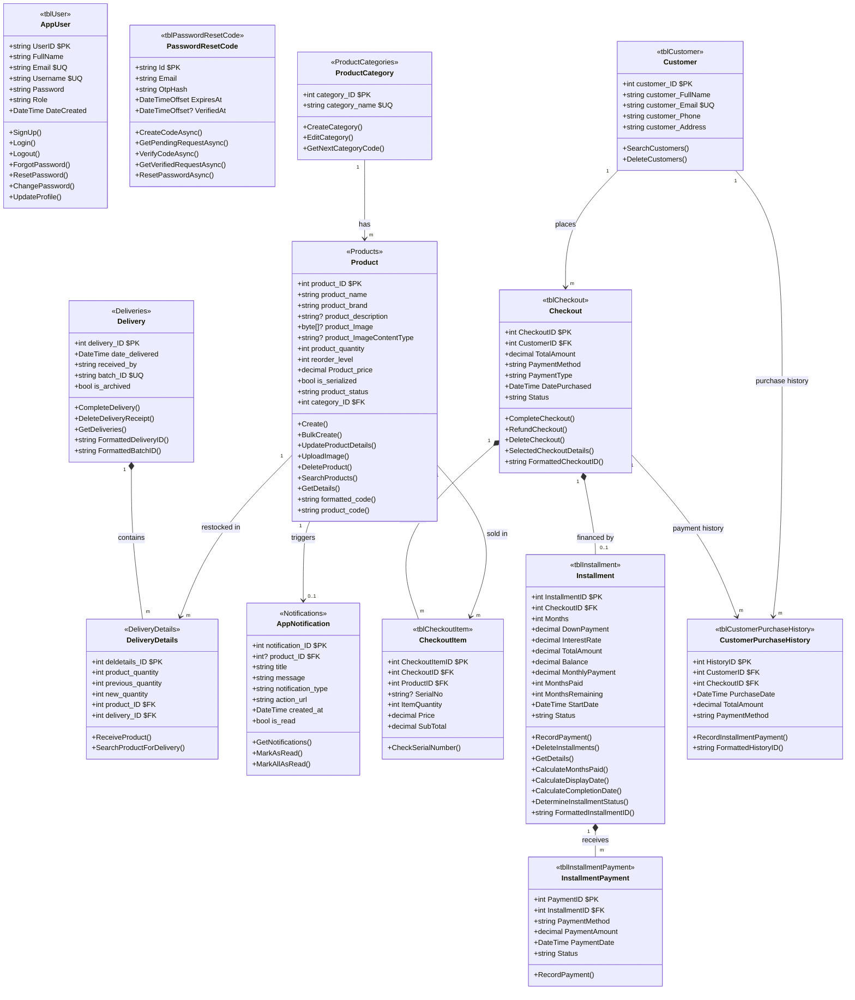

# Data Model (UML)

Mermaid `classDiagram` for the live editor at https://mermaid.live — classes from the
`Models` folder only. Every class shows the three compartments: **Name**, **Attributes**,
and **Operations**.

> Operations = the controller/service actions that manage that record, plus the
> `[NotMapped]` computed getters defined on the class (shown with `()`).
> The 16 report snapshot entities were removed in the report refactor; reports are now
> computed live at runtime from the business tables below.
>
> Relationships: `*--` (composition) marks records that **cannot exist without their
> parent** and are cascade-deleted with it (Delivery→DeliveryDetails, Checkout→CheckoutItem,
> Checkout→Installment, Installment→InstallmentPayment). `-->` (association) links records
> that live independently.

